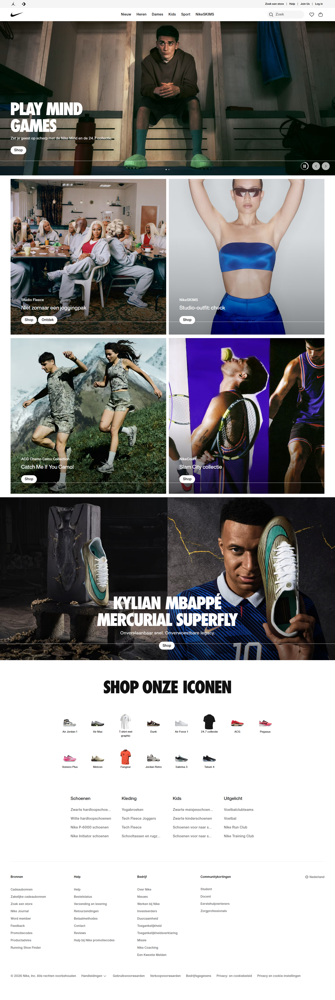
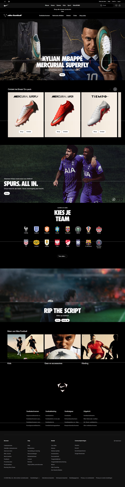
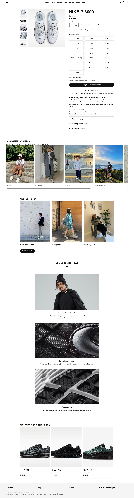
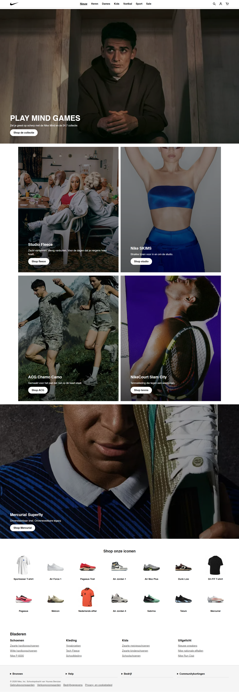

# Procesverslag
Markdown is een simpele manier om HTML te schrijven.  
Markdown cheat cheet: [Hulp bij het schrijven van Markdown](https://github.com/adam-p/markdown-here/wiki/Markdown-Cheatsheet).

Nb. De standaardstructuur en de spartaanse opmaak van de README.md zijn helemaal prima. Het gaat om de inhoud van je procesverslag. Besteedt de tijd voor pracht en praal aan je website.

Nb. Door *open* toe te voegen aan een *details* element kun je deze standaard open zetten. Fijn om dat steeds voor de relevante stuk(ken) te doen.

## Jij

  
uitwerken voor kick-off werkgroep

  ### Auteur:
  Younes Benzian

  #### Je startniveau:
rood

  #### Je focus:
Responsive
 

## Je website

  
uitwerken voor kick-off werkgroep

  ### Je opdracht:
Nike.nl

  #### Screenshot(s) van de eerste pagina (small screen): 
  hier de naam van de pagina  
  

  #### Screenshot(s) van de tweede pagina (small screen):
  hier de naam van de pagina  
  
 

## Toegankelijkheidstest 1/2 (week 1)

  
uitwerken na test in 2e werkgroep

  ### Bevindingen
  -

## Breakdownschets (week 1)

  
uitwerken na afloop 3e werkgroep

  ### de hele pagina: 
  

  ### dynamisch deel (bijv menu): 
  

  ### wellicht nog een dynamisch deel (bijv filter): 
  

## Voortgang 1 (week 2)

  
uitwerken voor 1e voortgang

  ### Stand van zaken
  - Hier had ik nog niet veel, ik was nog in de ban met of ik de plaatjes op me home pagina in een UL moest zetten of allemaal in aparte sections. Na advies van Danny besloot ik toch om ze in sectiosn te zetten zodat stijlen wat makkelijker is.

  ### Agenda voor meeting
  samen met je groepje opstellen

  | student 1      | student 2          | student 3    | student 4        |
  | ---            | ---                | ---          | ---              |
  | dit bespreken  | en dit             | en ik dit    | en dan ik dat    |
  | en dat ook nog | dit als er tijd is | nog een punt | dit wil ik zeker |
  | ...            | ...                | ...          | ...              |

  ### Verslag van meeting
  hier na afloop snel de uitkomsten van de meeting vastleggen

  - Ik heb code onderschat
  - Gebruik grid wanneer je denkt in 2 lijnen, flexbox wanneer je in 1 lijn denkt.
  - Niet alle animaties moeten, zo heeft beijvoorbeeld nike bepaalde scroll animaties die met javascript moeten, zelf denk ik nogsteeds dat dit met css kan maar had niet de ruimte om dit te vragen.

## Voortgang 2 (week 3)

  
uitwerken voor 2e voortgang

  ### Stand van zaken
  hier dit ging goed & dit was lastig (neem ook screenshots op van delen van je website en code)

  ### Agenda voor meeting
  samen met je groepje opstellen

  | student 1      | student 2          | student 3    | student 4        |
  | ---            | ---                | ---          | ---              |
  | dit bespreken  | en dit             | en ik dit    | en dan ik dat    |
  | en dat ook nog | dit als er tijd is | nog een punt | dit wil ik zeker |
  | ...            | ...                | ...          | ...              |

  ### Verslag van meeting
  hier na afloop snel de uitkomsten van de meeting vastleggen

  - punt 1
  - punt 2
  - nog een punt
- ...

## Toegankelijkheidstest 2/2 (week 4)

  
uitwerken na test in 9e werkgroep

  ### Bevindingen
 ---> Nike heeft geen dark mode, dit heb ik wel in mijn site.

Voor de rest ging alles goed,contrasten zijn duidelijk en nike heeft een pause button bij de mediaplayer in de eerste sectie.

## Voortgang 3 (week 4)

  
uitwerken voor 3e voortgang

  ### Stand van zaken
  hier dit ging goed & dit was lastig (neem ook screenshots op van delen van je website en code)

  ### Agenda voor meeting
  samen met je groepje opstellen

  | student 1      | student 2          | student 3    | student 4        |
  | ---            | ---                | ---          | ---              |
  | dit bespreken  | en dit             | en ik dit    | en dan ik dat    |
  | en dat ook nog | dit als er tijd is | nog een punt | dit wil ik zeker |
  | ...            | ...                | ...          | ...              |

  ### Verslag van meeting
  hier na afloop snel de uitkomsten van de meeting vastleggen

  - punt 1
  - punt 2
  - nog een punt
  - ...

## Eindgesprek (week 5)

  
uitwerken voor eindgesprek

  ### Je uitkomst - karakteristiek screenshots:
  

  ### Dit ging goed/Heb ik geleerd: 
  - Voorgaande jaren heb ik veel tijd verspilt aan het recoveren van problemen, dit was dit keer veel minder. Ik heb 1 copy gebruikt als speeltuin en ben dat als een soort codepen gaan gebruiken. 

  - Flexbox is een plank. Grid is een ladekast.
<!-- Op een plank zet je spullen naast elkaar. Elk ding neemt de ruimte die het zelf nodig heeft, en is de plank vol dan gaat de rest naar de volgende plank. Die twee planken hebben niks met elkaar te maken.

Bij een ladekast liggen de vakjes al vast voordat je er iets in legt. Alles wat je erin doet wordt even groot, en de vakjes staan netjes boven elkaar in rijen én kolommen tegelijk.

Flex = de inhoud bepaalt de maat. Eén richting.
Grid = jij bepaalt de maat. Twee richtingen. -->

  

  ### Dit was lastig/Is niet gelukt:
  Bij maak de look af zijn het eigenlijk op de site meerdere plaatjes die erg specifiek is ingedeeld, hier had ik moeite mee dus heb ik gewoon een screenshot genomen en dit als geheel als img gebruikt, bij nader inzien was dit volgensmij een kwestie van position en dan inset inline start maar dat heb ik nog niet volledig uitgeprobeerd.

  Iets sticky maken bij scrollen. dit had ik gedaan bij de voeg toe aan winkel in de detail pagina en hierbij had je een class nodig. uiteindelijk cond ik dit iets te moeilijk en ben ik er halverwege mee gestopt.

  De sticky scroll bij het product bij volle breedte heb ik niet kunnen doen door tijdnood, ook heb ik de hoop opgegeven toen ik zag dat voor bijvoorbeeld javascript nodig was voor de sticky winkelmand onderaan de pagina. CSS kan blijkbaar niet weten op welke hoogte je scrollt en javascript kan dat wel.

  Ik wou het overal cleaner maken, hier was ik veel tijd kwijt aangezien ik een andere font gebruikt, mijn font heeft of normaal of vet. en dit zorgde ervoor dat ik tekst niet zachter kon uitdrukken

  Grijze gebied boven de header. 

  

  

## Bronnenlijst

  
continu bijhouden terwijl je werkt

  Nb. Wees specifiek ('css-tricks' als bron is bijv. niet specifiek genoeg). 
  Nb. ChatGpT en andere AI horen er ook bij.
  Nb. Vermeld de bronnen ook in je code.

https://developer.mozilla.org/en-US/docs/Web/CSS/Reference/Properties/aspect-ratio
https://developer.mozilla.org/en-US/docs/Web/CSS/Reference/Properties/overflow
https://developer.mozilla.org/en-US/docs/Web/CSS/Reference/Properties/grid
https://developer.mozilla.org/en-US/docs/Web/CSS/Reference/Properties/margin
http://developer.mozilla.org/en-US/docs/Web/CSS/Reference/Properties/overflow
hamburgermenu = https://codepen.io/shooft/pen/ZEVYyMQ
https://developer.mozilla.org/en-US/docs/Web/CSS/Reference/Properties/position
stylesheet https://developer.mozilla.org/en-US/docs/Web/CSS/Reference/Properties/--*
Carousel https://codepen.io/shooft/pen/QwjQGZe
translate https://developer.mozilla.org/en-US/docs/Web/CSS/Reference/Values/transform-function/translate
justify content https://developer.mozilla.org/en-US/docs/Web/CSS/Reference/Properties/justify-content
https://developer.mozilla.org/en-US/docs/Web/CSS/Reference/Properties/order
Responsive https://developer.mozilla.org/en-US/docs/Web/CSS/Reference/At-rules/@media
fieldset https://developer.mozilla.org/en-US/docs/Web/CSS/Reference/Properties/appearance
https://developer.mozilla.org/en-US/docs/Web/CSS/Reference/Properties/display
Anthropic. (2026). Claude [Large language model]. https://claude.ai
// https://developer.mozilla.org/en-US/docs/Web/API/Window/matchMedia
https://developer.mozilla.org/en-US/docs/Web/API/MediaQueryList/change_event
https://developer.mozilla.org/en-US/docs/Web/API/NodeList/forEach

Hoe heb ik AI gebruikt?
--> Ik had 1 bestand gebruikt als speeltuin, hier kon ik mijn code erin zetten en meerdere dingen bewust chaotisch door elkaar heen doen zodat ik wist wat de gevolgen waren.

--> Ik heb Claude Anthropic gebruikt om bepaalde codes uit te leggen als ik er niet doorheen kwam bij mdm mozilla. Ook de standaard vragen die spookte door me hoofd bijvoorbeeld het verschil tussen flexbox en grid en alle andere codes die naar mijn mening op elkaar lijken heb ik aan claude voor een uitleg gevraagd. Ook als een code niet werkte stuurde ik dit op en kreeg ik uitleg waarom iets niet werkte en hoe dat dan in elkaar zit.

Aria labels weg bij plekken waar het niet nodig is en wel bij HAMBURGER MENU
Footer fixen (details Summary)
WCAG Checklist doen

FEEDBACK VERWERKT:
- Nav-Aria-label weggehaald bij de footer en geplaatst bij hamburger menu en gekeken waar het wel kan.
- WCAG checklist gemaakt.
- Details gefixt
- Footer gefixt.
----- Dit moest uiteindelijk met javascript. In HTML kon ik wel het eerste blokje op <open> zetten maar op de nike site zelf klappen ze allemaal uit zodra je meer breedte hebt. in principe kon dit misschien met 2 footers en dan 1 op visible zetten bij @media, alleen ben ik bang dat de screenreader dit 2 keer zal lezen.

